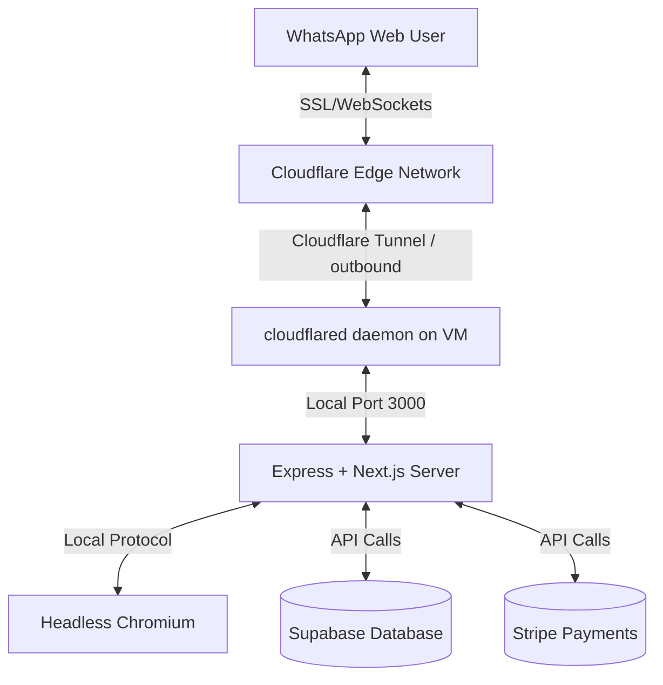

# Deploying Next Extraction Bot on Oracle Cloud Infrastructure (Always Free)

This guide walks you through deploying the **Next Extraction Bot** completely for free using the **Oracle Cloud Infrastructure (OCI) Always Free VM** tier and **Cloudflare Tunnels** for automated SSL, domain management, and secure firewall routing without opening external ports.

---

## Architecture Diagram



---

## Phase 1: Oracle Cloud VM Provisioning

### 1. Sign Up & Log In
- Go to [Oracle Cloud Free Tier](https://www.oracle.com/cloud/free/) and sign up. You will need a credit card for identity check, but you will not be charged.
- Log into your Oracle Cloud Console.

### 2. Create a Compute Instance
1. Go to **Compute** -> **Instances** -> **Create Instance**.
2. **Name**: `next-extraction-bot-vm`.
3. **Placement**: Choose default Availability Domain.
4. **Image and Shape**:
   - **Image**: **Ubuntu 22.04 LTS** (or Ubuntu 24.04).
   - **Shape**: Click **Edit Shape** -> Choose **Ampere (ARM64)** -> **VM.Standard.A1.Flex**.
   - **Resources**: Set to **2 OCPUs** and **12 GB RAM** (or up to 4 OCPUs and 24 GB RAM for the maximum Always Free limits). This gives Puppeteer plenty of memory to run Chrome!
5. **Networking**: Choose default VCN (Virtual Cloud Network) and Subnet.
6. **SSH Keys**: Click **Save Private Key** to download the `.key` file. You will need this to connect via SSH.
7. **Boot Volume**: Keep default settings.
8. Click **Create** and wait a few minutes for the instance status to show **Running**. Note your **Public IP Address**.

---

## Phase 2: Setup VM & Install Dependencies

Open your local terminal and connect to your VM using your SSH private key:

```bash
# Set correct permissions on the downloaded SSH key
chmod 400 /path/to/your-key.key

# Connect via SSH (replace with your VM public IP)
ssh -i /path/to/your-key.key ubuntu@YOUR_VM_PUBLIC_IP
```

Once logged into your VM, run the following commands to install packages:

### 1. System Updates & Node.js
```bash
# Update system packages
sudo apt-get update && sudo apt-get upgrade -y

# Install Node.js v20 LTS
curl -fsSL https://deb.nodesource.com/setup_20.x | sudo -E bash -
sudo apt-get install -y nodejs
```

### 2. Install Chromium & Puppeteer System Libraries
Since OCI VM standard Ampere instances run on ARM64 architecture, you must install the ARM64-compiled package of Chromium from the package manager.

```bash
# Install Chromium Browser and fonts
sudo apt-get install -y chromium-browser fonts-ipafont-gothic fonts-wqy-zenhei \
  fonts-thai-tlwg fonts-kacst fonts-freefont-ttf libxss1 --no-install-recommends

# Verify the path of Chromium (should output: /usr/bin/chromium-browser or /usr/bin/chromium)
which chromium-browser
```

### 3. Install PM2 (Process Manager)
```bash
sudo npm install -g pm2
```

---

## Phase 3: Deploy the Code

### 1. Clone & Install
```bash
# Clone your repository to the VM
git clone <YOUR_GIT_REPO_URL> /app/next-extraction-bot
cd /app/next-extraction-bot

# Install dependencies
npm install
```

### 2. Configure Environment Variables
Create a production `.env` file on the VM:
```bash
nano .env
```
Paste in your credentials, updating key variables for production:
```env
PORT=3000
APP_URL=https://your-custom-domain.com
NEXT_PUBLIC_SITE_URL=https://your-custom-domain.com

# Use your remote Supabase endpoints
NEXT_PUBLIC_SUPABASE_URL=https://jyeoqmjfujxxxpeingip.supabase.co
NEXT_PUBLIC_SUPABASE_ANON_KEY=...
SUPABASE_SERVICE_ROLE_KEY=...

# Use production Stripe credentials (or test mode if testing)
STRIPE_PUBLISHABLE_KEY=pk_live_...
STRIPE_SECRET_KEY=sk_live_...
STRIPE_WEBHOOK_SECRET=whsec_...
STRIPE_PRICE_ID_PRO=prod_...
STRIPE_PRICE_ID_UNLIMITED=prod_...
```
Press `Ctrl + O` to save, and `Ctrl + X` to exit.

### 3. Build & Run
Build the Next.js production app:
```bash
npm run build
```

---

## Phase 4: Configure Cloudflare Tunnel

A Cloudflare Tunnel connects your server directly to Cloudflare without opening any inbound ports (e.g. no port forwarding, no Nginx setup, no security risk).

### 1. Setup on Cloudflare Dashboard
1. Sign up/log in to [Cloudflare](https://dash.cloudflare.com/) (Free).
2. Point your domain to Cloudflare's Nameservers (or use a free domain linked to your account).
3. In the sidebar, go to **Zero Trust** -> **Networks** -> **Tunnels** -> **Create a Tunnel**.
4. Name the tunnel: `next-extraction-bot`.
5. Under **Choose environment**, select **Debian (64-bit)** or **ARM64** depending on your VM architecture (Oracle Ampere is **ARM64**).
6. Copy the install command under the Cloudflare dashboard (it looks like `curl -L ... && sudo cloudflared service install ...`).

### 2. Run Install Command on VM
Paste the copied command from Cloudflare into your VM ssh session. This will install the `cloudflared` daemon and run it as a system service.

### 3. Route Traffic
1. Back in the Cloudflare Zero Trust Dashboard, click **Next** to go to the **Route Traffic** tab.
2. Select your domain (e.g. `extractor.mydomain.com`).
3. Under **Service**, select:
   - **Type**: `HTTP`
   - **URL**: `localhost:3000`
4. Under **Additional Application Settings** -> **HTTP Settings**:
   - Enable **WebSockets** (this allows Socket.io to function).
5. Click **Save Tunnel**. Your app is now accessible via HTTPS on your domain!

---

## Phase 5: Run Production Process with PM2

To ensure the extraction bot runs 24/7 and restarts automatically if Chrome or Node encounters an exception, launch it via PM2 using the configured `ecosystem.config.js`:

```bash
# Start the app with PM2 in production mode
pm2 start ecosystem.config.js --env production

# Check status and logs
pm2 status
pm2 logs next-extraction-bot
```

### Enable Start on System Boot
To automatically start your server if the Oracle Cloud VM rebooted (e.g., due to maintenance):
```bash
# Generate boot script configuration
pm2 startup

# (Copy and run the command printed by PM2 on your terminal)

# Save current PM2 processes to startup list
pm2 save
```

---

## Phase 6: Webhook Configuration

1. Go to your **Stripe Dashboard** -> **Developers** -> **Webhooks**.
2. Click **Add Endpoint**.
3. Set the endpoint URL to: `https://your-custom-domain.com/api/stripe/webhook` (replace with your Cloudflare domain).
4. Select the events: `checkout.session.completed` and `customer.subscription.updated`.
5. Retrieve your Webhook Signing Secret (`whsec_...`) and update your `.env` on the VM if you haven't already.

---

> [!TIP]
> **Checking Logs & QR Codes**
> Because the server runs headless with PM2 in the background, you won't see the QR code terminal print directly to your screen. However, you can see it via PM2 logs:
> ```bash
> pm2 logs next-extraction-bot --lines 100
> ```
> Alternatively, connect using the web interface on your domain. The Web UI will render the QR code dynamically via the websocket stream!
